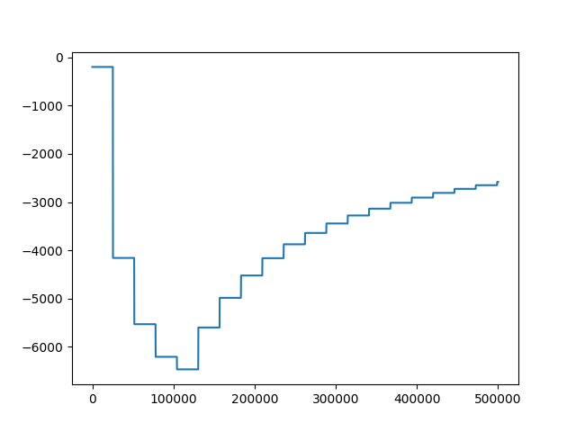

## Actor-Critic Algorithm

In Actor-Critic algorithms, we simultaneously train an actor (policy) and a critic (value function). The actor guides the agent's actions, and the critic evaluates the state or state-action values.

### Mathematical Formulation


```math
\mathbb{E}_{\pi_{\theta}} \left[ \left( \sum_{t=0}^{T} \nabla_{\theta} \log \pi_{\theta}(a_t|s_t) \cdot A_{\pi_{\theta}}(s_t, a_t) \right)^2 \leq \left( \sum_{t=0}^{T} (\nabla_{\theta} \log \pi_{\theta}(a_t|s_t))^2 \right) \cdot \mathbb{E}_{\pi_{\theta}} \left[ \sum_{t=0}^{T} (A_{\pi_{\theta}}(s_t, a_t))^2 \right] \right]
```

To run vanilla DDQN - 

```
python DQN.py
```

To run Actor Crtic DDQN - 

```
python DQN-AC.py
```


